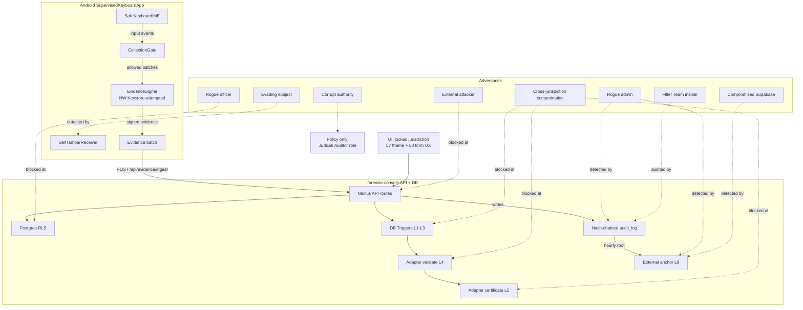
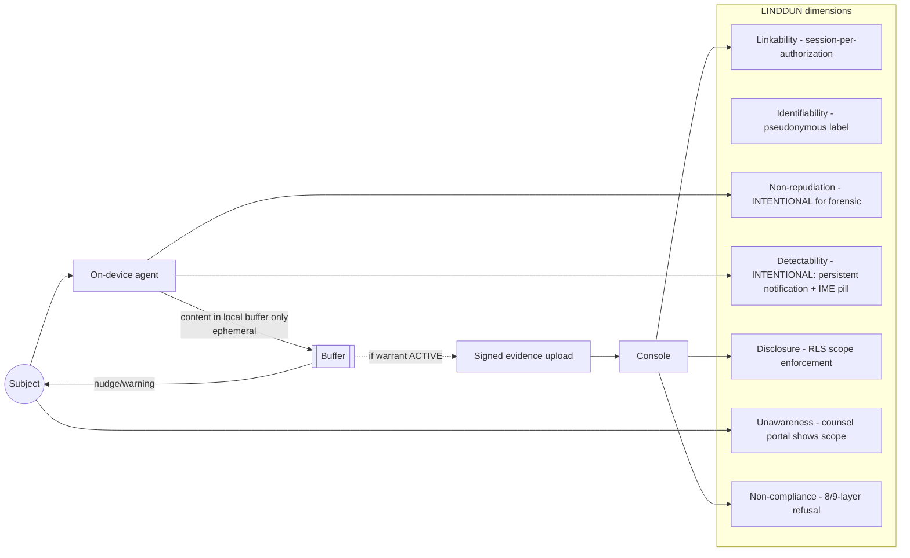

# Threat Model Diagram

Single-page diagrammatic summary of `docs/paper/THREAT_MODEL.md`. Two views: (a) STRIDE per component, (b) adversary-to-defense mapping. Both are Mermaid so they render inline on GitHub and export to SVG via mermaid-cli for the paper.

---

## Diagram 1 — Component-level defense stack



---

## Diagram 2 — LINDDUN privacy analysis (subject view)



---

## Diagram 3 — Cross-jurisdictional refusal (Element 6, the money shot)

```mermaid
flowchart TD
    OFFICER[Officer submits<br/>warrant with mixed<br/>statute references] --> API[/api/authorizations POST/]

    API --> L4{Adapter L4:<br/>validateAuthorization}
    L4 -->|contamination| REJECT1[REJECT<br/>with statute list]
    L4 -->|clean| DBW[DB write]

    DBW --> L1{L1: case.jurisdiction<br/>immutable trigger}
    L1 --> L2{L2: auth.jurisdiction<br/>= case.jurisdiction}
    L2 --> L3{L3: statute_references<br/>prefix matches jurisdiction}
    L3 -->|contamination| REJECT2[REJECT<br/>at DB layer]
    L3 -->|clean| INSERTED[(Authorization inserted)]

    INSERTED --> CERT{L5: Adapter certificate<br/>generation refuses<br/>cross-prefix mix}
    CERT -->|contamination| REJECT3[REJECT<br/>at cert layer]
    CERT -->|clean| PDF[BSA §63 / §2518(8)(a) / IPA §56<br/>certificate]

    INSERTED -.-> RLS{L6: RLS scoping<br/>on read time}
    RLS -->|different jurisdiction| SILENT[Silent zero rows]

    style REJECT1 fill:#fee,stroke:#c00
    style REJECT2 fill:#fee,stroke:#c00
    style REJECT3 fill:#fee,stroke:#c00
    style SILENT fill:#fee,stroke:#c00
    style PDF fill:#efe,stroke:#0a0
```

---

## Rendering to SVG for the paper

```bash
npm install -g @mermaid-js/mermaid-cli
mkdir -p docs/paper/figures
mmdc -i docs/paper/figures/THREAT_MODEL_DIAGRAM.md -o docs/paper/figures/threat-model.svg
```

Or copy each ```mermaid block into https://mermaid.live and export.

---

## Caption for the paper

> **Figure X — Cross-jurisdictional contamination refusal at five architectural layers.** An officer submits an authorization whose `statute_references` mix `IN_*` and `US_*` prefixes. The request is refused at (L4) the adapter's `validateAuthorization` before any DB write; if bypassed via service-role, it is refused at (L1–L3) the Postgres triggers on the `case`, `authorization`, and `statute_references` columns; if the record already exists, the certificate generator (L5) refuses to render a §63 / §2518(8)(a) / §56 certificate carrying mixed prefixes; and at read-time, RLS (L6) silently returns zero rows to officers whose `home_jurisdiction` does not match. Layers L7 (per-jurisdiction UI theming) and L8 (case-jurisdiction is set at creation and never at authorization time) prevent honest human error at the officer level. Layer L9 (externally-anchored audit chain) makes any silent tamper by a service-role attacker publicly detectable.
